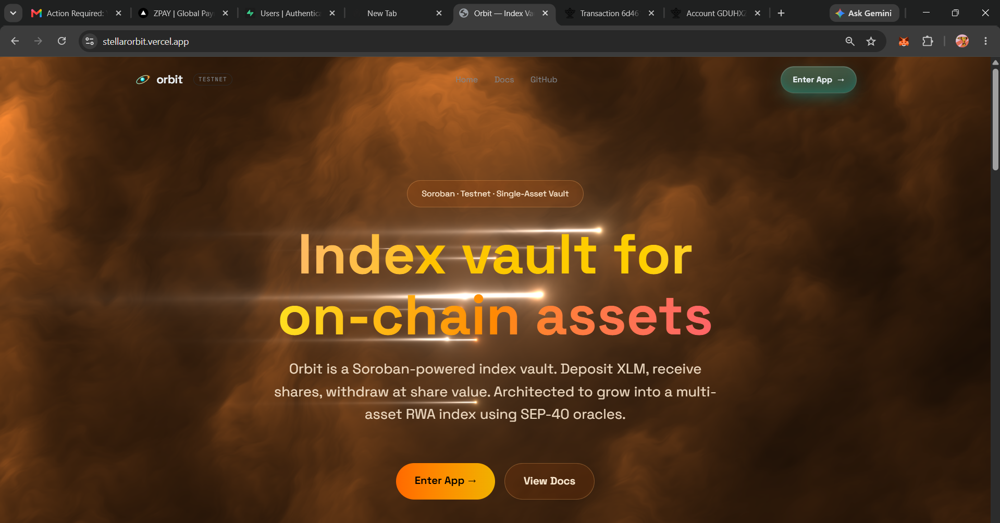
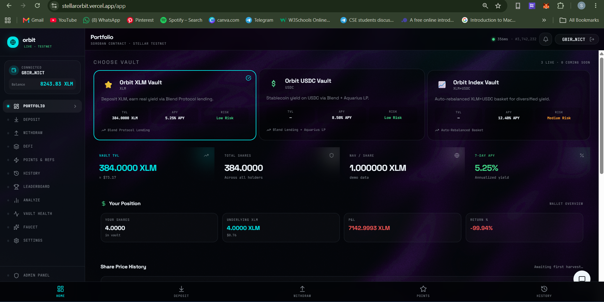
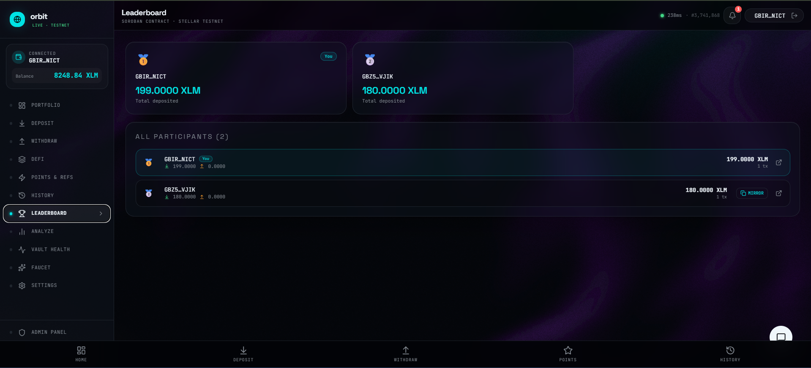
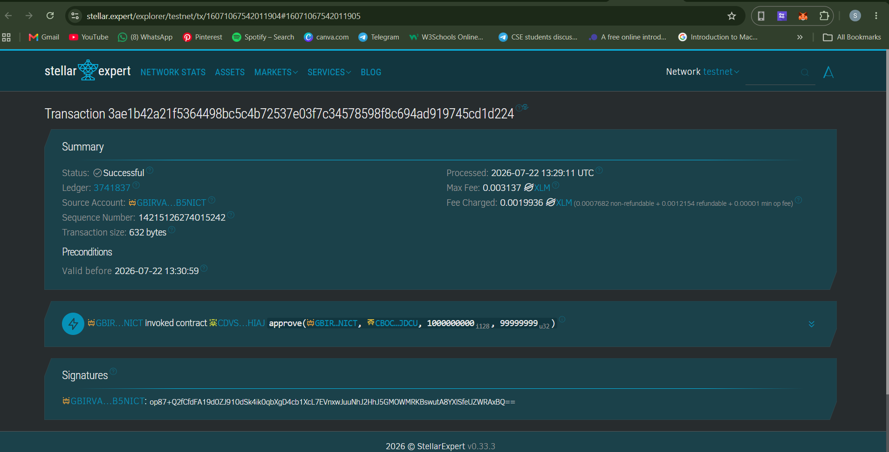

<div align="center">

# 🌌 Orbit Protocol

### _The first full-stack DeFi protocol built entirely on Stellar Soroban_

**Earn real yield · Split your returns · Lend with collateral · All on Stellar Testnet**

[](https://stellarorbit.vercel.app/)
[](https://youtu.be/Git4e0q-HzY)
[](https://stellar.org)
[](https://soroban.stellar.org)
[](#)

### 📺 [Watch the Full Demo on YouTube →](https://youtu.be/Git4e0q-HzY)

</div>

---

## ✨ What Is Orbit?

Orbit is a **complete DeFi ecosystem** built natively on Stellar using Soroban smart contracts. It's not just a yield vault — it's a full protocol stack that lets you:

1. **Deposit XLM** → Earn real yield from Blend Protocol lending
2. **Split your yield** → Separate your principal from future earnings using Yield Tranching
3. **Borrow against your position** → Use your Orbit tokens as collateral in a trustless P2P market
4. **Track everything** → Real-time analytics, leaderboards, and portfolio insights — all from on-chain data

> Built in 6 phases over ~2 months, Orbit demonstrates that **institutional-grade DeFi is possible on Stellar today**.

---

## 🔴 Live On Testnet

| Resource | Details |
|----------|---------|
| 🌐 **Live App** | [stellarorbit.vercel.app](https://stellarorbit.vercel.app/) |
| 📺 **Demo Video** | [Watch on YouTube](https://youtu.be/Git4e0q-HzY) |
| 🔗 **Network** | Stellar Testnet |
| 📡 **Soroban RPC** | `https://soroban-testnet.stellar.org` |
| 💸 **Latest Transaction** | [`3ae1b42a...d1d224`](https://stellar.expert/explorer/testnet/tx/3ae1b42a21f5364498bc5c4b72537e03f7c34578598f8c694ad919745cd1d224) |

---

## 🏗️ Deployed Smart Contracts

All contracts are live on **Stellar Testnet** and fully functional.

| Contract | Address | Explorer |
|----------|---------|---------|
| 🏦 **Orbit XLM Vault** | `CBLDIHKSHOXC3Q3R2YNCT54OPTX5QRALNYKK3UDNZ4KAQD7DEINJYV5P` | [View ↗](https://stellar.expert/explorer/testnet/contract/CBLDIHKSHOXC3Q3R2YNCT54OPTX5QRALNYKK3UDNZ4KAQD7DEINJYV5P) |
| 🪙 **oXLM Share Token** | `CDVS3OBGU6JERC4MZAW6BW75HLMVW5QFBCHUKPV5VEWGVXGJBRR5HIAJ` | [View ↗](https://stellar.expert/explorer/testnet/contract/CDVS3OBGU6JERC4MZAW6BW75HLMVW5QFBCHUKPV5VEWGVXGJBRR5HIAJ) |
| ✂️ **Orbit Tranche v2** | `CBOCF47NMQAT7TS4X4CTS7D3MPAD4MIPMOBZPUE5EOM52WTAIOOVJDCU` | [View ↗](https://stellar.expert/explorer/testnet/contract/CBOCF47NMQAT7TS4X4CTS7D3MPAD4MIPMOBZPUE5EOM52WTAIOOVJDCU) |
| 📜 **PT Token** | `CDPI7TU3B7ZW3RMT3NINGI22MCBMKUI6L52YYDA7Y3ZCIRD4FQPT4JQL` | [View ↗](https://stellar.expert/explorer/testnet/contract/CDPI7TU3B7ZW3RMT3NINGI22MCBMKUI6L52YYDA7Y3ZCIRD4FQPT4JQL) |
| 🌾 **YT Token** | `CB6ZGGBSIB3EJYME3KI7MGKBJZELXI4HWGDSANLRZI74DULFKQZSRKCR` | [View ↗](https://stellar.expert/explorer/testnet/contract/CB6ZGGBSIB3EJYME3KI7MGKBJZELXI4HWGDSANLRZI74DULFKQZSRKCR) |
| 🤝 **P2P Market** | `CBU7OPCENTV6XT33IYNBNYVC7YU2PNQD4X22TBAI4R72Q2QBVMERLGWT` | [View ↗](https://stellar.expert/explorer/testnet/contract/CBU7OPCENTV6XT33IYNBNYVC7YU2PNQD4X22TBAI4R72Q2QBVMERLGWT) |
| 💵 **Test USDC** | `CBM6JPPGBESHXXPW6YKGSM2W6CVEL7KHQ6WDWXVDBSY2QWHD4K6R4N2I` | [View ↗](https://stellar.expert/explorer/testnet/contract/CBM6JPPGBESHXXPW6YKGSM2W6CVEL7KHQ6WDWXVDBSY2QWHD4K6R4N2I) |

---

## 🖼️ Screenshots

### 🏠 Landing Page

> The Orbit landing page hero with orbit animation, key stats, and primary CTA to get started.

---

### 🖥️ App Dashboard

> The full vault dashboard — balances, share position, oracle price panel, and recent activity feed.

---

### 💸 Deposit Flow

> Deposit flow showing XLM input, share preview, and the success card with transaction hash after completion.

---

### 🔗 Transaction Hash

> A close-up of the on-chain transaction hash shown after every deposit or withdrawal.

---

### ⚙️ CI/CD Pipeline

> GitHub Actions workflow showing the automated build, test, and deploy pipeline for the smart contracts and frontend.

---

### 📊 Analytics Dashboard

> Real-time TVL, deposit volume, and multi-day APY charts powered by live Soroban event polling — no backend indexer required.

---

### 💰 Yield Tracking

> Track your Principal Tokens (PT) and Yield Tokens (YT) in real time. See exactly how much yield you've generated versus your locked principal.

---

### 🤝 P2P Lending Market

> A fully trustless peer-to-peer money market. Lenders post USDC offers with fixed terms, borrowers lock Orbit tokens as collateral and take loans instantly — no liquidation bots needed.

---

### 📈 Portfolio Analyzer

> Visual compound growth projections, strategy comparison charts, and your complete position breakdown across all Orbit assets.

---

### 🏥 Vault Health Monitor

> Live vault health metrics — TVL utilization, idle assets, APY trend, and performance fee tracking, all pulled directly from the Soroban contract.

---

### 🏆 Leaderboard

> Global depositor rankings derived entirely from on-chain Soroban events. Your rank updates in real time as others deposit.

---

### 🎁 Referral & Points System

> Earn Orbit Points for every deposit and referral. Share your referral link to climb the leaderboard and unlock protocol rewards.

---

### 📋 Transaction History

> Full deposit/withdrawal history with Stellar Explorer links for every transaction.

---

### 💳 Transaction Details

> On-chain transaction confirmation card showing your deposit amount, shares minted, and a direct link to the Stellar Explorer.

---

## 🔄 System Architecture & Full Flow

```
┌─────────────────────────────────────────────────────────────────────┐
│                        USER JOURNEY                                  │
└─────────────────────────────────────────────────────────────────────┘

  User connects wallet (Freighter / Albedo / Lobstr / xBull)
        │
        ▼
  ┌─────────────┐     deposit XLM      ┌──────────────────────────────┐
  │  Orbit App  │ ──────────────────▶  │   orbit-vault (Soroban)      │
  │  (Next.js / │                      │                              │
  │  TanStack)  │ ◀──────────────────  │  • Accepts XLM deposits      │
  └─────────────┘   mint oXLM shares   │  • Mints oXLM share tokens   │
        │                              │  • Tracks TVL / NAV          │
        │                              │  • Harvest admin yield       │
        │                              └──────────────┬───────────────┘
        │                                             │
        │                                             │ yield strategy
        │                                             ▼
        │                              ┌──────────────────────────────┐
        │                              │   Blend Protocol Pool        │
        │                              │   (cross-contract lending)   │
        │                              │   Real APY flows back        │
        │                              └──────────────────────────────┘
        │
        │  YIELD TRANCHING (New Feature!)
        │
        ├──── user calls Wrap Shares ──▶ ┌────────────────────────────┐
        │                                │  orbit-tranche (Soroban)   │
        │                                │                            │
        │   ┌─── PT Token (Principal) ── │  Splits oXLM shares into:  │
        │   │                            │  • PT: redeem for exact    │
        │   └─── YT Token (Yield) ────── │       principal value      │
        │                                │  • YT: claim yield above   │
        │                                │       principal            │
        │                                └────────────────────────────┘
        │
        │  P2P COLLATERAL MARKET (New Feature!)
        │
        └──── Lender posts USDC ────────▶ ┌────────────────────────────┐
             Borrower locks PT/YT ──────▶ │  orbit-market (Soroban)    │
                                           │                            │
             Borrower gets USDC ◀───────── │  • Fixed term / interest   │
             Loan repaid + unlock ◀─────── │  • No liquidation needed   │
                                           │  • Trustless escrow        │
                                           └────────────────────────────┘

─────────────────────────────────────────────────────────────────────
                     FRONTEND DATA FLOW
─────────────────────────────────────────────────────────────────────

  Soroban RPC ──▶ fetchContractEvents() ──▶ Analytics Charts
                                         ──▶ Leaderboard Rankings
                                         ──▶ Transaction History
                                         ──▶ TVL / Volume Metrics

  Supabase ──▶ User auth + display names ──▶ Global Leaderboard
            ──▶ Referral tracking        ──▶ Orbit Points system

  SEP-40 Oracle ──▶ XLM/USD price feed ──▶ USD TVL, portfolio value
```

---

## 🚀 Feature Highlights

### ✅ Core Vault (Phases 1–4)
| Feature | Description |
|---------|-------------|
| 🔐 **Multi-Wallet Connect** | Freighter, Albedo, Lobstr, xBull via StellarWalletsKit |
| 💳 **Deposit & Withdraw** | Real Soroban contract calls with wallet signing |
| 🪙 **SEP-41 Share Token** | oXLM — a transferable token representing your vault share |
| 📊 **Live Analytics** | TVL, volume, APY charts from real on-chain events |
| 🏆 **Leaderboard** | Global depositor rankings from Soroban events |
| 🌐 **PWA** | Installable on mobile & desktop, works offline |
| 💰 **Fiat On-Ramp** | Buy crypto with fiat via SEP-24 |
| 🤖 **Zap Deposits** | Deposit any Stellar asset (auto-routed through Soroswap) |

### ✅ DeFi Super-Protocol (Phases 5–6) — **NEW**
| Feature | Description |
|---------|-------------|
| ✂️ **Yield Tranching** | Split oXLM shares into PT (principal) + YT (yield) tokens |
| 🔒 **Principal Protection** | PT holders redeem exact XLM value deposited — zero impermanent loss |
| 🌾 **Yield Speculation** | YT holders claim all variable yield generated above principal |
| 🤝 **P2P Collateral Loans** | Lend USDC or borrow against PT/YT as collateral |
| 📊 **Yield Dashboard** | Real-time PT/YT balance tracking and yield projections |
| 🎯 **Orbit Points** | Earn points for deposits and referrals |
| 👥 **Referral System** | Share your link, earn bonus points when friends deposit |

---

## ⚡ How It Works — Step by Step

### Step 1: Get Testnet XLM
Click "Fund Wallet" in the app → Friendbot sends you 10,000 testnet XLM instantly.

### Step 2: Deposit XLM
Enter an amount → your wallet pops up → sign → XLM is locked in the Soroban vault and you receive **oXLM shares**.

### Step 3: Earn Yield
The vault deploys your XLM into Blend Protocol lending. Yield accrues automatically, reflected in the rising share price.

### Step 4: (Optional) Wrap Shares — Yield Tranching
Go to **DeFi Super-Protocol** → Wrap your oXLM shares:
- You get **PT tokens** — redeem later for your exact original XLM value
- You get **YT tokens** — claim all yield generated while your position is open

### Step 5: (Optional) Use as Collateral
In the **P2P Market**, lock your PT/YT as collateral to borrow USDC instantly from other users — or become a lender by posting USDC offers.

### Step 6: Withdraw
Burn your oXLM shares → receive XLM back at current NAV. If share price rose, you profit the difference.

---

## 🧱 Project Structure

```
stellarorbit/
├── contracts/
│   ├── orbit-vault/          Soroban vault — deposit, withdraw, share math, harvest
│   ├── orbit-share-token/    SEP-41 oXLM share token with minter access control
│   ├── orbit-tranche/        Yield stripping — split shares into PT + YT tokens
│   ├── orbit-market/         P2P collateral lending — create_offer, borrow, repay
│   ├── orbit-points/         On-chain points tracking for gamification
│   └── orbit-zap-router/     Cross-asset deposit router (mock DEX for testnet)
│
├── src/
│   ├── routes/               TanStack Start page routes
│   ├── components/orbit/     All UI components (dashboard, deposit, withdraw, defi, etc.)
│   ├── hooks/                React hooks (use-vault, use-wallet, use-defi)
│   └── lib/stellar/          Soroban helpers (network, vault, events, soroban RPC)
│
├── Screenshots/              UI screenshots for this README
├── docs/                     Architecture diagrams and docs
└── scripts/                  Deploy scripts for Soroban contracts
```

---

## 🛠️ Local Development

### Prerequisites
- Node 20+ and `bun` or `npm`
- Rust with `wasm32v1-none` target (for contract builds)
- `stellar-cli` v27+ (`cargo install stellar-cli`)
- A Stellar wallet (Freighter recommended)

### Quick Start

```bash
# Clone
git clone https://github.com/Sristipriya/stellarorbit.git
cd stellarorbit

# Install dependencies
npm install

# Copy env template
cp .env.example .env

# Start dev server
npm run dev   # http://localhost:8080
```

### Build Contracts

```bash
# Build a specific contract (requires stellar-cli)
stellar contract build --package orbit-tranche
stellar contract build --package orbit-vault

# Deploy to testnet
stellar contract deploy \
  --wasm target/wasm32v1-none/release/orbit_vault.wasm \
  --source-account orbit-deployer \
  --network testnet
```

---

## 🔐 Environment Variables

| Variable | Required | Description |
|----------|----------|-------------|
| `VITE_ORBIT_VAULT_CONTRACT_ID` | No | Overrides default vault contract |
| `VITE_ORBIT_TRANCHE_CONTRACT_ID` | No | Overrides default tranche contract |
| `VITE_SUPABASE_URL` | No | Supabase project URL for user auth |
| `VITE_SUPABASE_ANON_KEY` | No | Supabase anon key |
| `VITE_ADMIN_USER` | No | Admin panel username (default: `admin`) |
| `VITE_ADMIN_PASS` | No | Admin panel password (default: `orbit2024`) |

> All contract IDs are hardcoded in `src/lib/stellar/network.ts` — no env vars needed to run the live version.

---

## 🗺️ Roadmap

| Phase | Feature | Status |
|-------|---------|--------|
| L1–L2 | Wallet connect + vault foundation | ✅ Complete |
| L3 | Full Soroban vault contract | ✅ Complete |
| L4 | Admin panel, leaderboard, simulator, oracle | ✅ Complete |
| L5 | Real-time events + Supabase auth | ✅ Complete |
| L6 | **Yield Tranching + P2P Lending Market** | ✅ Complete |
| L7 | Automated DEX rebalancing, Mainnet launch | 🔜 Planned |

---

## 🛡️ Security Notes

- All contracts use Soroban's native auth framework (`require_auth`)
- The tranche contract uses allowance-based `transfer_from` to avoid nested auth issues with wallet extensions
- Share token minter access is controlled by `set_minter` — only the vault can mint oXLM
- PT/YT token minting is restricted to the tranche contract

---

## 📄 Disclaimer

This is a **testnet-only** project built for demonstration and competition purposes. Not financial advice. All tokens are worthless testnet assets. Do not send real funds.

---

<div align="center">

**Built with ❤️ on Stellar Soroban**

[Live Demo](https://stellarorbit.vercel.app/) · [📺 Demo Video](https://youtu.be/Git4e0q-HzY) · [Stellar Explorer](https://stellar.expert/explorer/testnet/contract/CBLDIHKSHOXC3Q3R2YNCT54OPTX5QRALNYKK3UDNZ4KAQD7DEINJYV5P) · [Latest Transaction](https://stellar.expert/explorer/testnet/tx/3ae1b42a21f5364498bc5c4b72537e03f7c34578598f8c694ad919745cd1d224)

</div>
