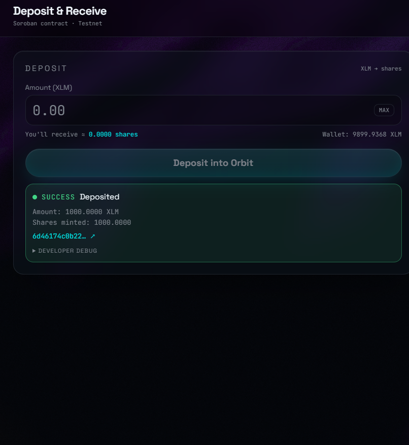

# Orbit — Index Vault on Stellar Testnet

> _Index vault for on-chain assets on Stellar._

Orbit is a Soroban-powered single-asset index vault deployed on **Stellar
Testnet**, architected to grow into a multi-asset RWA index using SEP-40
oracles. Connect a Stellar wallet, fund via Friendbot, deposit XLM into the
vault contract, receive shares, and withdraw at share value.

## Architecture

```text
 ┌────────────────┐   sign tx (XDR)    ┌──────────────────────┐
 │ Stellar wallet │ ◀───────────────── │  Orbit web app       │
 │ (Freighter,    │ ─signed XDR──────▶ │  (TanStack Start)    │
 │  Albedo, xBull,│                    │  /  + /app routes    │
 │  Lobstr)       │                    └──────────┬───────────┘
 └────────────────┘                               │ Horizon / Soroban RPC
                                                  ▼
                                       ┌──────────────────────┐
                                       │  Soroban contract    │
                                       │  contracts/orbit-vault│
                                       │  deposit / withdraw   │
                                       │  balance_of / price   │
                                       └──────────┬───────────┘
                                                  ▼
                                       ┌──────────────────────┐
                                       │  L4+ : SEP-40 oracles│
                                       │  multi-asset RWA NAV │
                                       └──────────────────────┘
```

## Repository layout

```text
contracts/orbit-vault/   Rust Soroban contract + tests (see its README)
src/routes/index.tsx     Landing page
src/routes/app.tsx       Vault dashboard
src/components/orbit/    Hero animation, cards, forms, activity feed, wallet UI
src/hooks/               useWallet, useVault
src/lib/stellar/         network · wallet kit · friendbot · balance · vault service
```

## Features

- **Multi-Wallet Support**: Connect via StellarWalletsKit (Freighter, Albedo, xBull, Lobstr).
- **Live Balances**: Real-time display of user's XLM and share balances.
- **Soroban Smart Contracts**: Deposit and withdraw paths natively call a Soroban vault contract on the Testnet.
- **Robust Error Handling**: Safely handles wallet-not-installed, user-rejected, insufficient-balance, and network errors.
- **Real-Time Activity Feed**: Event-driven UI updates immediately on deposits and withdrawals.
- **Comprehensive Testing**: Rust unit tests cover share math, deposits, withdrawals, and over-withdraw guards.
- **Extensible Architecture**: Code layout is designed for multi-asset expansion and oracle integration.

## Setup

### Prerequisites

- Node 20+, `bun` (or `pnpm`)
- Rust + `wasm32-unknown-unknown` target
- `stellar-cli` (`cargo install --locked stellar-cli`) and `jq`
- A Stellar wallet extension (Freighter recommended)

### One-command setup (fresh clone)

```bash
scripts/setup.sh
bun run dev   # http://localhost:8080
```

`scripts/setup.sh` installs JS deps, runs the contract tests, deploys the
Soroban vault to Stellar Testnet, and writes `VITE_ORBIT_VAULT_CONTRACT_ID`
into `.env` so the frontend talks to the live contract on next start.

If you only want to run the UI in demo mode (no contract deploy):

```bash
scripts/setup.sh --skip-deploy
bun run dev
```

### Deploy / redeploy only the contract

```bash
scripts/deploy-vault.sh                 # uses identity "orbit-deployer"
scripts/deploy-vault.sh my-identity     # use a different stellar-cli identity
```

This builds `contracts/orbit-vault`, funds the deployer via Friendbot,
uploads + deploys the WASM with the native XLM SAC as the underlying asset,
and updates `.env` in place. See
[`contracts/orbit-vault/README.md`](contracts/orbit-vault/README.md) for the
underlying `stellar contract` commands.

### Modes

- **Real mode** (`VITE_ORBIT_VAULT_CONTRACT_ID` set): the UI reads
  `total_assets` / `total_shares` / `balance_of` directly from the contract,
  deposits/withdrawals call the contract via Soroban RPC + wallet signing,
  and the activity feed reconciles from Soroban contract events.
- **Demo mode** (no contract ID): each deposit/withdraw is a real signed
  Testnet payment with an `orbit:dep:<xlm>` / `orbit:wd:<xlm>` memo and the
  activity feed reconciles from Horizon by reading those memos. Share state
  is held in `localStorage` until the contract is live.

## Screenshots

Here are a few inline screenshots to give a quick feel for the app UI.

### Landing


Shows the landing page hero with the orbit animation and primary CTA.

### Deposit / Success



Deposit flow and success card — this includes the transaction hash shown on success.

### Dashboard


The vault dashboard showing balances, share position, and recent activity.

### Transaction Hash


A crop of the transaction hash / details as shown after a deposit.

## 🚀 Deployed Contract Information

- **Live Demo Link:** [https://stellarorbit.vercel.app/](https://stellarorbit.vercel.app/)
- **Deployed Contract Address:** `CAEVXCBXW6CFCOELPQQ2D2KZ6JVVT5T6RQA5NCD3WGG6JJ5UC3XZD4OJ`
- **Recent Transaction Hash:** `4cbeda5d4223cca5235c8f5dad269de26e6373b2369c3ce483ffc092aacb46a3`
- **Network:** Stellar Testnet
- **Soroban RPC URL:** `https://soroban-testnet.stellar.org`

## Disclaimer

Testnet only. Not financial advice. Demo-mode share ledger lives in your
browser; it disappears when localStorage is cleared. Real share state lives
on-chain only once the contract is deployed and `VITE_ORBIT_VAULT_CONTRACT_ID`
is configured.
