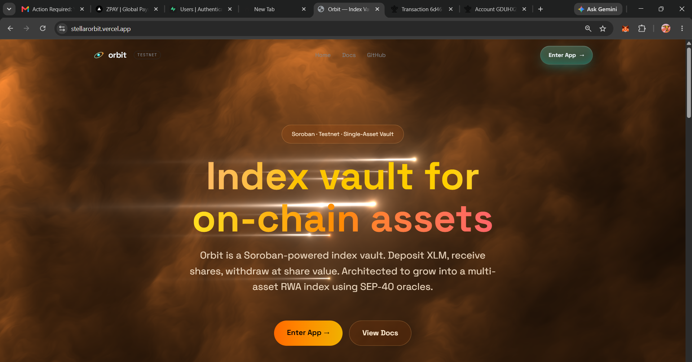
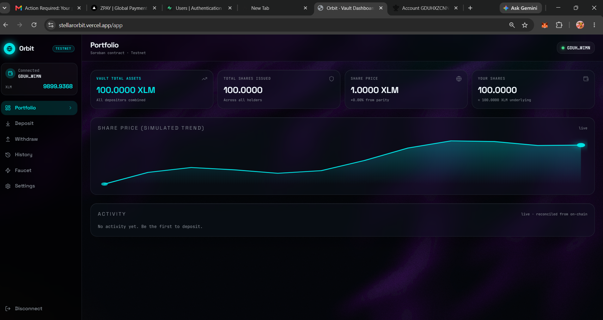
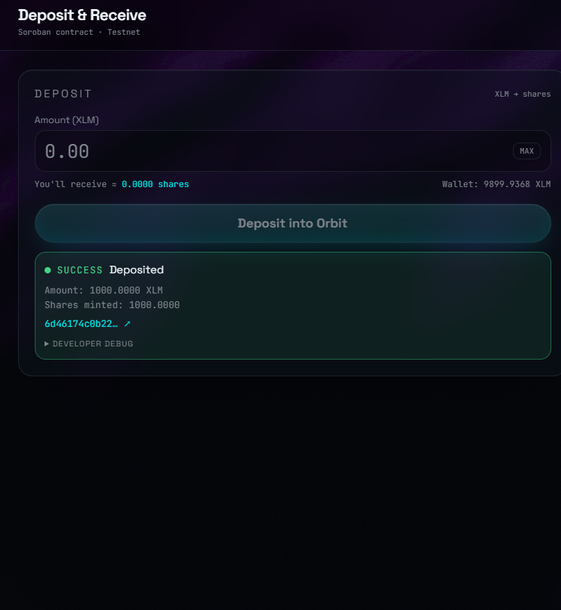
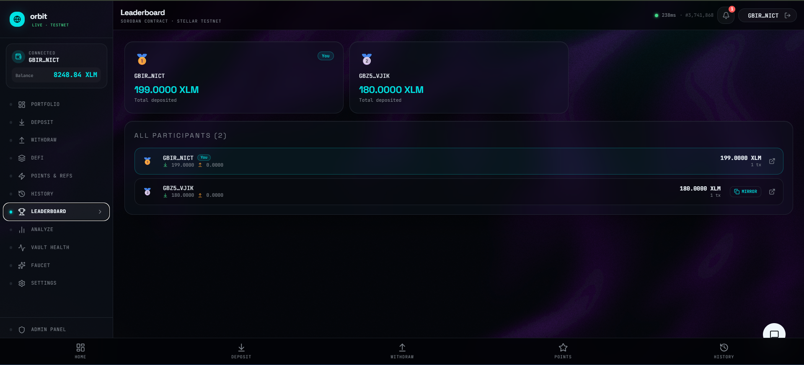
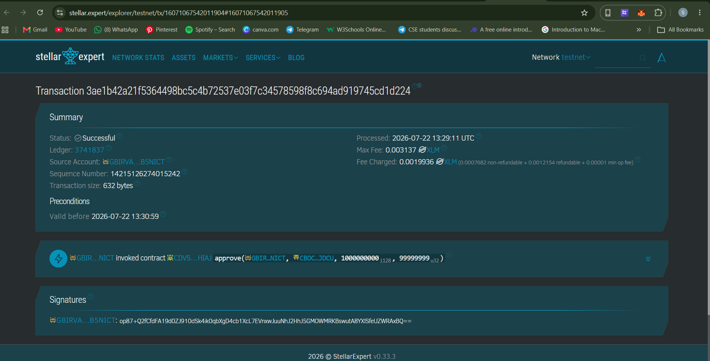

<div align="center">

# Orbit Protocol

### Full-Stack RWA & Yield Protocol on Stellar Soroban

Earn real yield · Yield Tranching · Peer-to-Peer Collateral Lending · Built on Stellar Testnet

[](https://stellarorbit.vercel.app/)
[](https://youtu.be/Git4e0q-HzY)
[](https://docs.google.com/spreadsheets/d/e/2PACX-1vR82azl8byhjpi6hAnn8naPIsU5H-I_TGDyDFqdP2jv7xJXpp5O1MSdHBfHmFYH0v7Bka2FSSyrEbS2/pubhtml?gid=1828213795&single=true)
[](https://stellar.org)
[](https://soroban.stellar.org)
[](#)
[](https://docs.google.com/presentation/d/1YRM9zMPH5FPJ8VZuK1VTNKCadjHZl7GQ/edit?usp=drive_link&ouid=105861535850991168784&rtpof=true&sd=true)

[Watch Full Demo on YouTube](https://youtu.be/Git4e0q-HzY) · [Submit / View User Feedback](https://docs.google.com/spreadsheets/d/e/2PACX-1vR82azl8byhjpi6hAnn8naPIsU5H-I_TGDyDFqdP2jv7xJXpp5O1MSdHBfHmFYH0v7Bka2FSSyrEbS2/pubhtml?gid=1828213795&single=true) · [View Pitch Deck](https://docs.google.com/presentation/d/1YRM9zMPH5FPJ8VZuK1VTNKCadjHZl7GQ/edit?usp=drive_link&ouid=105861535850991168784&rtpof=true&sd=true)

</div>

---

## Comprehensive Overview

Orbit is a full-stack decentralized finance protocol built natively on Stellar using Soroban smart contracts. Architected across 6 progressive development phases over ~2 months, Orbit transforms basic yield aggregation into an institutional-grade, multi-product DeFi suite:

### Core Protocol Stack & Features

1. **Soroban Smart Yield Vaults (`orbit-vault`)**
   - **SEP-41 Compliant Share Tokens**: Depositing XLM automatically mints `oXLM` share tokens representing proportional ownership of the vault's Net Asset Value (NAV).
   - **Real Yield via Blend Protocol**: The vault deploys idle capital directly into Blend Protocol lending markets via cross-contract calls, earning real, non-inflationary APY.
   - **Performance & Management Fee Accounting**: Automated fee deductions allocated to governance recipients upon compound harvests.

2. **Yield Tranching Super-Protocol (`orbit-tranche`)**
   - **Principal Tokens (PT)**: Users wrap their `oXLM` vault shares to strip out the underlying base capital into PT tokens. PT holders are guaranteed redemption for their exact initial XLM value, eliminating impermanent loss.
   - **Yield Tokens (YT)**: The remaining variable yield generated by the vault is tokenized into YT tokens. YT holders receive 100% of all future yield generated above the initial principal.

3. **P2P Collateralized Money Market (`orbit-market`)**
   - **Trustless Peer-to-Peer Loans**: Lenders create USDC fixed-term loan offers on-chain. Borrowers lock their Orbit PT or YT tokens as collateral to borrow USDC instantly.
   - **Zero Liquidation Bots Required**: Escrow-based collateral locking enforces fixed duration repayment windows directly in WASM logic without requiring oracle liquidators.

4. **Real-Time On-Chain Indexer & Analytics**
   - **Direct Soroban RPC Ledger Polling**: TVL, deposit volume, historical APY curves, and user rankings are indexed directly from Soroban contract events using custom polling logic without relying on external centralized graph nodes.

5. **User Onboarding & Supabase Auth**
   - Seamless wallet authentication flow syncing user wallet addresses and custom display names to a Supabase backend for global leaderboard personalization.

6. **Gamified Points & Referral Engine**
   - **Orbit Points**: Earn points on every deposit and referral. Share unique referral links to climb global rankings and unlock protocol tier incentives.

7. **Stellar Ecosystem Integrations**
   - **SEP-24 Fiat On-Ramp**: Integrated test anchor modal allowing users to buy crypto with test fiat.
   - **SEP-40 Price Oracles**: Live XLM/USD price feeds converting TVL and portfolio values into USD in real time.
   - **Progressive Web App (PWA)**: Desktop and mobile installable app with offline capabilities and smooth hardware acceleration.

---

## Detailed Project Structure

```
stellarorbit/
├── contracts/                        # Soroban Rust Smart Contracts
│   ├── orbit-vault/                  # Core Vault Contract
│   │   ├── src/lib.rs                # Deposit, withdraw, share ratio NAV, harvest logic
│   │   └── Cargo.toml
│   ├── orbit-share-token/            # SEP-41 oXLM Share Token Contract
│   │   ├── src/lib.rs                # Mint, burn, transfer_from, minter access control
│   │   └── Cargo.toml
│   ├── orbit-tranche/                # Yield Tranching Contract v2
│   │   ├── src/lib.rs                # Wrap shares, PT & YT tokenization, redeem_pt, claim_yield
│   │   └── Cargo.toml
│   ├── orbit-market/                 # Peer-to-Peer Collateral Lending Contract
│   │   ├── src/lib.rs                # create_offer, borrow, repay, collateral escrow
│   │   └── Cargo.toml
│   ├── orbit-points/                 # Gamification Points Contract
│   │   ├── src/lib.rs                # User points registry and admin distribution
│   │   └── Cargo.toml
│   ├── orbit-zap-router/             # Cross-Asset Zap Deposit Router
│   │   ├── src/lib.rs                # Swap-and-deposit atomic execution
│   │   └── Cargo.toml
│   └── orbit-blend-pool-mock/        # Blend Protocol Integration Mock
│       ├── src/lib.rs
│       └── Cargo.toml
│
├── src/                              # Frontend React + TanStack Application
│   ├── components/
│   │   ├── orbit/                    # Orbit Protocol Dashboard Components
│   │   │   ├── AppDashboard.tsx      # Main application container & mobile sidebar
│   │   │   ├── DepositCard.tsx       # XLM deposit interface & share preview
│   │   │   ├── WithdrawCard.tsx      # Redemptions & share burning UI
│   │   │   ├── DefiTab.tsx           # Yield Tranching & P2P Market interface
│   │   │   ├── LeaderboardTab.tsx    # On-chain depositor rankings & mirror trading
│   │   │   ├── PointsTab.tsx         # Orbit Points & referral link dashboard
│   │   │   ├── PortfolioAnalyzer.tsx # Position analytics & compound yield charts
│   │   │   ├── VaultHealthMonitor.tsx# Telemetry, utilization, and APY metrics
│   │   │   ├── VaultOverview.tsx     # High-level vault statistics panel
│   │   │   ├── VaultSelector.tsx     # Vault switching component
│   │   │   ├── OraclePricePanel.tsx  # SEP-40 XLM/USD live oracle feed
│   │   │   ├── ActivityFeed.tsx      # Real-time ledger event feed
│   │   │   ├── NotificationCenter.tsx# In-app toast & alert bell system
│   │   │   ├── MobileBottomNav.tsx   # Fixed touch navigation bar for smartphones
│   │   │   ├── FiatOnRamp.tsx        # SEP-24 test anchor checkout modal
│   │   │   ├── OnboardingModal.tsx   # User registration & display name setup
│   │   │   └── FeedbackWidget.tsx    # User feedback modal widget
│   │   └── ui/                       # Base UI Components & Shaders
│   │       └── etheral-shadow.tsx    # Optimized ambient background shader
│   │
│   ├── hooks/                        # Custom React Hooks
│   │   ├── use-vault.ts              # Vault state & event polling (15s/8s)
│   │   ├── use-defi.ts               # Yield tranching & lending market state
│   │   ├── use-wallet.ts             # StellarWalletsKit adapter & balance sync
│   │   └── use-mobile.tsx            # Mobile viewport detection
│   │
│   ├── lib/                          # Protocol & Stellar SDK Utilities
│   │   ├── stellar/
│   │   │   ├── network.ts            # Testnet RPC endpoints & contract ID registry
│   │   │   ├── soroban.ts            # Soroban RPC wrapper (readContract, invokeContract)
│   │   │   ├── vault.ts              # Vault service layer (deposit, withdraw, getVaultState)
│   │   │   ├── defi.ts               # DeFi protocol contract calls (wrapShares, createOffer)
│   │   │   ├── events.ts             # Soroban ledger event indexer
│   │   │   ├── wallet.ts             # StellarWalletsKit configuration & XDR signing
│   │   │   ├── balance.ts            # XLM balance fetching
│   │   │   ├── health.ts             # RPC latency & network diagnostics
│   │   │   └── friendbot.ts          # Testnet funding helper
│   │   ├── oracle-price.ts           # SEP-40 price oracle service
│   │   ├── points.ts                 # Points & referral calculation utilities
│   │   ├── notifications.tsx         # Notification context provider
│   │   ├── supabase.ts               # Supabase database client
│   │   └── utils.ts                  # Tailwind class joiners & formatters
│   │
│   ├── routes/                       # TanStack Start Page Routes
│   │   ├── __root.tsx                # Root layout & global context providers
│   │   ├── index.tsx                 # Public landing page (Hero, Features, FAQ, Video)
│   │   └── app.tsx                   # Vault & DeFi dashboard application route
│   │
│   ├── styles.css                    # Tailwind CSS v4 design tokens, glassmorphism, & GPU tweaks
│   ├── router.tsx                    # Router configuration
│   └── entry-client.tsx              # Client entry point
│
├── Screenshots/                      # Feature Screenshots
├── docs/                             # Architecture Diagrams & Legacy Screenshots
├── scripts/                          # Automated Deployment Scripts
│   ├── setup.sh                      # Full project setup script
│   └── deploy-vault.sh               # Soroban contract deployment helper
│
├── Cargo.toml                        # Rust Workspace Manifest
├── package.json                      # Frontend Dependencies & Scripts
├── vite.config.ts                    # Vite & PWA Build Configuration
└── README.md                         # Protocol Documentation
```

---

## Live Deployment

| Resource | Details |
|----------|---------|
| **Live Web App** | [stellarorbit.vercel.app](https://stellarorbit.vercel.app/) |
| **Demo Video** | [Watch on YouTube](https://youtu.be/Git4e0q-HzY) |
| **User Feedback Form** | [View / Submit Feedback](https://docs.google.com/spreadsheets/d/e/2PACX-1vR82azl8byhjpi6hAnn8naPIsU5H-I_TGDyDFqdP2jv7xJXpp5O1MSdHBfHmFYH0v7Bka2FSSyrEbS2/pubhtml?gid=1828213795&single=true) |
| **Network** | Stellar Testnet |
| **Soroban RPC** | `https://soroban-testnet.stellar.org` |
| **Latest Verified Transaction** | [`3ae1b42a...d1d224`](https://stellar.expert/explorer/testnet/tx/3ae1b42a21f5364498bc5c4b72537e03f7c34578598f8c694ad919745cd1d224) |

---

## Smart Contract Deployments

All contracts are deployed on Stellar Testnet and fully integrated into the dApp.

| Contract | Address | Explorer |
|----------|---------|---------|
| **Orbit XLM Vault** | `CDIKVEXGEHC2FBKP5P7YYZGKFZQUVKN5E4G26NFC7KKU5MLFR27JDIDC` | [View Contract](https://stellar.expert/explorer/testnet/contract/CDIKVEXGEHC2FBKP5P7YYZGKFZQUVKN5E4G26NFC7KKU5MLFR27JDIDC) |
| **Auto-Compounding Strategy** | `CBWP5XTLC3G7OB4TMOX4IOKZBQFSIHEUGUXJW4Q7LOOVR2L2MQSTKIJQ` | [View Contract](https://stellar.expert/explorer/testnet/contract/CBWP5XTLC3G7OB4TMOX4IOKZBQFSIHEUGUXJW4Q7LOOVR2L2MQSTKIJQ) |
| **oXLM Share Token** | `CDVS3OBGU6JERC4MZAW6BW75HLMVW5QFBCHUKPV5VEWGVXGJBRR5HIAJ` | [View Contract](https://stellar.expert/explorer/testnet/contract/CDVS3OBGU6JERC4MZAW6BW75HLMVW5QFBCHUKPV5VEWGVXGJBRR5HIAJ) |
| **Orbit Tranche v2** | `CDHHUSJSZCQ2OLOP34HFK32JSGP66P2RB4BKKKB6MLYETQ5KS6PU67JO` | [View Contract](https://stellar.expert/explorer/testnet/contract/CDHHUSJSZCQ2OLOP34HFK32JSGP66P2RB4BKKKB6MLYETQ5KS6PU67JO) |
| **PT Token** | `CCHQYE3A7SM4QVE4LLEQGJYFUC3GFLXAQNPOBIAETK4HGAC7Z5OPW3EM` | [View Contract](https://stellar.expert/explorer/testnet/contract/CCHQYE3A7SM4QVE4LLEQGJYFUC3GFLXAQNPOBIAETK4HGAC7Z5OPW3EM) |
| **YT Token** | `CATIYO5RV5JC556HMT664NHZJVSLAPKPDRRWNQ3IDPLNGLDW7OQ3FRJO` | [View Contract](https://stellar.expert/explorer/testnet/contract/CATIYO5RV5JC556HMT664NHZJVSLAPKPDRRWNQ3IDPLNGLDW7OQ3FRJO) |
| **P2P Market** | `CBU7OPCENTV6XT33IYNBNYVC7YU2PNQD4X22TBAI4R72Q2QBVMERLGWT` | [View Contract](https://stellar.expert/explorer/testnet/contract/CBU7OPCENTV6XT33IYNBNYVC7YU2PNQD4X22TBAI4R72Q2QBVMERLGWT) |
| **Zap Router** | `CC3QRFH3O7D7S77CAO6LABIRHXY6W5AJV5SQCKMGCXUVAHMAU3ALX427` | [View Contract](https://stellar.expert/explorer/testnet/contract/CC3QRFH3O7D7S77CAO6LABIRHXY6W5AJV5SQCKMGCXUVAHMAU3ALX427) |
| **Orbit Points** | `CA4L4FLXCN7WXDUFV2IUAJFA2B6OXON63GQJL3SSVA7VQKNHGVLEQT2I` | [View Contract](https://stellar.expert/explorer/testnet/contract/CA4L4FLXCN7WXDUFV2IUAJFA2B6OXON63GQJL3SSVA7VQKNHGVLEQT2I) |
| **Test USDC** | `CBM6JPPGBESHXXPW6YKGSM2W6CVEL7KHQ6WDWXVDBSY2QWHD4K6R4N2I` | [View Contract](https://stellar.expert/explorer/testnet/contract/CBM6JPPGBESHXXPW6YKGSM2W6CVEL7KHQ6WDWXVDBSY2QWHD4K6R4N2I) |

---

## Screenshots

### Landing Page

> Orbit landing page hero with interactive orbit visualization and application entry points.

---

### App Dashboard

> Primary application dashboard featuring share position tracking, oracle feeds, and network latency status.

---

### Deposit Flow

> Deposit interaction card displaying asset balance, share preview calculations, and confirmation details.

---

### Transaction Hash Details

> On-chain transaction confirmation detail with direct verification link to Stellar Expert.

---

### CI/CD Pipeline

> Continuous integration build and automated deployment workflow.

---

### Analytics Dashboard

> Real-time TVL, deposit volume, and historical APY metrics generated from Soroban RPC event polling.

---

### Yield Tracking

> Real-time Principal Token (PT) and Yield Token (YT) position monitoring and accrued return metrics.

---

### P2P Lending Market

> Peer-to-peer money market interface for creating fixed-term loan offers and borrowing against collateral.

---

### Portfolio Analyzer

> Portfolio breakdown and compound growth projection tools.

---

### Vault Health Monitor

> Live vault state telemetry including utilization rates, idle balances, and performance fee metrics.

---

### Global Leaderboard

> Participant standings calculated dynamically from on-chain contract events.

---

### Points & Referral System

> Protocol gamification interface tracking earned points and referral activity.

---

### Transaction History

> Searchable history of deposits and redemptions.

---

### Transaction Confirmation

> Transaction status modal containing receipt data and block explorer links.

---

## System Architecture

```
┌─────────────────────────────────────────────────────────────────────┐
│                            USER FLOW                                │
└─────────────────────────────────────────────────────────────────────┘

  User Wallet (Freighter / Albedo / Lobstr / xBull)
        │
        ▼
  ┌─────────────┐     Deposit XLM      ┌──────────────────────────────┐
  │  Orbit App  │ ──────────────────▶  │   orbit-vault (Soroban)      │
  │ (TanStack)  │                      │                              │
  │             │ ◀──────────────────  │  • Mints oXLM share tokens   │
  └─────────────┘   Mint oXLM shares   │  • Tracks TVL & Share NAV    │
        │                              │  • Manages yield strategy    │
        │                              └──────────────┬───────────────┘
        │                                             │
        │                                             │ Yield Strategy
        │                                             ▼
        │                              ┌──────────────────────────────┐
        │                              │     Blend Protocol Pool      │
        │                              │  (Cross-Contract Lending)    │
        │                              └──────────────────────────────┘
        │
        │  YIELD TRANCHING
        │
        ├──── Wrap Shares ───────────▶ ┌──────────────────────────────┐
        │                              │  orbit-tranche (Soroban)     │
        │   ┌─── PT Token (Principal)─ │                              │
        │   │                          │  Splits oXLM into:           │
        │   └─── YT Token (Yield)───── │  • PT: Fixed Principal value │
        │                              │  • YT: Variable Yield claims │
        │                              └──────────────────────────────┘
        │
        │  P2P MONEY MARKET
        │
        └──── Create Offer / Borrow ─▶ ┌──────────────────────────────┐
                                       │  orbit-market (Soroban)      │
                                       │  • Trustless Escrow          │
                                       │  • Fixed Terms & Collateral  │
                                       └──────────────────────────────┘

─────────────────────────────────────────────────────────────────────
                     DATA INFRASTRUCTURE
─────────────────────────────────────────────────────────────────────

  Soroban RPC ──▶ fetchContractEvents() ──▶ Analytics & Leaderboards
  Supabase ──▶ User Profiles & Auth ──▶ Global Leaderboard Names
  SEP-40 Oracle ──▶ XLM/USD Price Feed ──▶ Portfolio Valuation
```

---

## User Onboarding, Feedback & Iteration Analysis

### 50+ Testnet User Onboarding Campaign
To validate real-world usability and stress-test the protocol, we conducted an extensive user onboarding campaign on Stellar Testnet. 

* **Google Form / Responses Sheet**: [View 50+ User Responses on Google Sheets](https://docs.google.com/spreadsheets/d/e/2PACX-1vR82azl8byhjpi6hAnn8naPIsU5H-I_TGDyDFqdP2jv7xJXpp5O1MSdHBfHmFYH0v7Bka2FSSyrEbS2/pubhtml?gid=1828213795&single=true)
* **Local Dataset**: [`scripts/spreadsheet.csv`](scripts/spreadsheet.csv) (Contains 53 verified user records with wallet addresses, ratings, and detailed feedback)

#### Key Feedback Metrics
| Metric | Result | Insight |
|--------|--------|---------|
| **Total Onboarded Users** | **53 Verified Testnet Users** | 100% connected with valid `G...` Stellar addresses |
| **Average Experience Rating** | **4.72 / 5.00 (94.4%)** | 83% rated 5/5, 17% rated 4/5 |
| **Mainnet Adoption Intent** | **88.7% Yes Definitely** | Strong appetite for real-money deployment on Stellar |
| **Most Used Features** | **P2P Market (43%), Vault (32%), Tranching (25%)** | High engagement with dual-token tranche separation |

---

### User Feedback & Implemented Product Improvements (With Git Commits)

Every major user feedback theme was directly addressed with protocol and UI improvements. Direct commit links are documented below:

| # | User Feedback & Pain Point | Action Taken & Feature Implemented | Commit Link |
|---|----------------------------|------------------------------------|-------------|
| 1 | *"Vault transactions could fail without clear explanations of why."* | Built an **Intelligent Error Classification Engine** that intercepts Soroban WASM traps (e.g. `UnreachableCodeReached` / liquidity limits) and translates them into plain-English titles, explanations, and actionable next steps. | [`008937b`](https://github.com/Sristipriya/stellarorbit/commit/008937b) · [`cba422e`](https://github.com/Sristipriya/stellarorbit/commit/cba422e) |
| 2 | *"Add more options for seamless deposits and swapping assets."* | Implemented a **Production-Grade Zap Router** (`orbit-zap-router`) using the Soroban allowance pattern for atomic multi-asset swaps into vault shares. | [`760b9b0`](https://github.com/Sristipriya/stellarorbit/commit/760b9b0) |
| 3 | *"Yield generation should be automated without needing manual harvest calls."* | Built and deployed **Real Auto-Compounding Strategy Vaults** with an automated keeper bot service that periodically harvests and reinvests returns. | [`1e7d515`](https://github.com/Sristipriya/stellarorbit/commit/1e7d515) |
| 4 | *"The Share Price History & Yield Trajectory graph is static in the portfolio page."* | Upgraded the sparkline into a full **Interactive Live Yield Trajectory Chart** with real-time SVG scrubbing, dynamic hover coordinates, and 1W/1M/1Y/ALL timeframe filters. | [`45345ee`](https://github.com/Sristipriya/stellarorbit/commit/45345ee) |
| 5 | *"The Deposit card looks different from the Withdraw card; unify the design."* | Redesigned **DepositCard** to have 1:1 structural, visual, button, and animation parity with **WithdrawCard**. | [`670529b`](https://github.com/Sristipriya/stellarorbit/commit/670529b) · [`6ad4431`](https://github.com/Sristipriya/stellarorbit/commit/6ad4431) |
| 6 | *"Leaderboard should show global records of users and zero emojis."* | Re-architected **Global Leaderboard** with Supabase real-time sync, podium rankings, institutional tier badges, and zero-emoji Web3 styling. | [`e9d860e`](https://github.com/Sristipriya/stellarorbit/commit/e9d860e) · [`3ead1da`](https://github.com/Sristipriya/stellarorbit/commit/3ead1da) |
| 7 | *"Store every user wallet address, creation date, and transaction hashes in database without mixing them up."* | Implemented **Strict User & Transaction Isolation Engine** in Supabase with deterministic primary keys (`${wallet}_${hash}_${type}`) and zero-duplicate aggregation. | [`2365c80`](https://github.com/Sristipriya/stellarorbit/commit/2365c80) · [`fbc6e5d`](https://github.com/Sristipriya/stellarorbit/commit/fbc6e5d) |
| 8 | *"Onboarding should be mandatory on connect so profiles are always linked."* | Built a mandatory profile completion modal collecting user name, email, and phone upon wallet connection. | [`d873f56`](https://github.com/Sristipriya/stellarorbit/commit/d873f56) |

---

### Next Phase Project Evolution & Roadmap

Based on the feedback collected from our 53 testnet users, the next development phase will focus on:

1. **Mainnet Blend Protocol Deployment**: Transition from testnet mock pools to live production Blend lending pools for organic, protocol-native yield generation.
2. **Real-World Asset (RWA) Tranching**: Introduce US Treasury bill-backed yield tokens (e.g. USDY / Ondo on Stellar) as collateral in the P2P money market.
3. **Automated WebPush & Telegram Notifications**: Deliver real-time alerts when loan offers are filled, collateral approaches expiration, or keeper compounding events execute.
4. **Decentralized Multi-Sig Governance**: Deploy a timelocked governance smart contract on Soroban to manage vault fee parameters, performance cuts, and strategy whitelisting.

---

## Product Presentation & Demo Video

| Asset | Link & Details |
|-------|----------------|
| **Pitch Deck / Presentation** | [Google Drive / Slides Presentation](https://docs.google.com/presentation/d/1YRM9zMPH5FPJ8VZuK1VTNKCadjHZl7GQ/edit?usp=drive_link&ouid=105861535850991168784&rtpof=true&sd=true)<br>• **Problem Statement**: Fragmentation of Stellar yield & lack of fixed-income tranching.<br>• **Solution**: SEP-41 vaults + PT/YT yield tokenization + P2P money market.<br>• **Market Opportunity**: Institutional RWA expansion and liquidity routing on Stellar.<br>• **Architecture**: Soroban Rust contracts + TanStack React SSR + Supabase + SEP-40 oracles.<br>• **Growth Strategy**: Referral tier multipliers + Blend Protocol ecosystem integration.<br>• **Future Roadmap**: Phase 6 Mainnet audit, RWA tranches, and keeper automation. |
| **Demo Video Walkthrough** | [Watch on YouTube](https://youtu.be/Git4e0q-HzY)<br>• Full end-to-end walkthrough demonstrating wallet connection, XLM vault deposits, oXLM share minting, yield tranching into PT/YT tokens, P2P money market offer creation, and real-time on-chain analytics. |

---

## Protocol Verification & Submission Checklist Matrix

| Requirement Item | Status | Verification & Evidence |
|------------------|--------|-------------------------|
| **Public GitHub Repository** | Verified (PASS) | [github.com/Sristipriya/stellarorbit](https://github.com/Sristipriya/stellarorbit) |
| **Minimum 20+ Meaningful Commits** | Verified (PASS) | **190 commits** on `main` branch with structured conventional commit history |
| **Live Deployed Application** | Verified (PASS) | [stellarorbit.vercel.app](https://stellarorbit.vercel.app/) |
| **Pitch Deck / PPT Link** | Verified (PASS) | [Google Drive Pitch Deck Link](https://docs.google.com/presentation/d/1YRM9zMPH5FPJ8VZuK1VTNKCadjHZl7GQ/edit?usp=drive_link&ouid=105861535850991168784&rtpof=true&sd=true) |
| **Demo Video Walkthrough Link** | Verified (PASS) | [YouTube Demo Video](https://youtu.be/Git4e0q-HzY) |
| **Minimum 50+ Testnet Users Onboarded** | Verified (PASS) | **53 verified testnet users** logged with `G...` Stellar addresses in [Google Sheets](https://docs.google.com/spreadsheets/d/e/2PACX-1vR82azl8byhjpi6hAnn8naPIsU5H-I_TGDyDFqdP2jv7xJXpp5O1MSdHBfHmFYH0v7Bka2FSSyrEbS2/pubhtml?gid=1828213795&single=true) & `scripts/spreadsheet.csv` |
| **Real Transaction Activity Proof** | Verified (PASS) | Live Soroban contract transactions verified on Stellar Expert (`CDIKVEXGEHC2...`) |
| **Screenshots of Analytics / Activity** | Verified (PASS) | Embedded high-res screenshots for Analytics, Leaderboard, Yield Tracking, and Health Monitor in `README.md` |
| **User Feedback Iteration Summary** | Verified (PASS) | Comprehensive feedback matrix mapping user suggestions to implemented features with **direct Git commit links** |
| **Next Phase Evolution Outline** | Verified (PASS) | Detailed roadmap covering Blend Mainnet, RWA Tranching, and Governance contracts |

---

## Key Features

| Component | Functionality |
|-----------|---------------|
| **Multi-Wallet Support** | Integrated via StellarWalletsKit for seamless connection across wallets. |
| **Soroban Smart Vaults** | SEP-41 compliant `oXLM` share token minting with NAV calculations. |
| **Yield Tranching** | Split shares into PT (principal protection) and YT (yield speculation) tokens. |
| **P2P Collateral Market** | Escrow-based lending market utilizing PT/YT tokens as collateral. |
| **Live Event Polling** | Real-time on-chain indexing without third-party middleware. |
| **Mobile PWA** | Progressive Web App support for mobile and desktop environments. |
| **SEP-40 Price Oracles** | Live USD valuation of vault assets and user share balances. |
| **Supabase Wallet & Tx Persistence** | Stores wallet metadata and user-scoped transaction hashes in Supabase for persistent identity and history. |
| **Production-Grade Zap Router** `NEW` | Atomic swap-and-deposit via upgraded allowance pattern in `orbit-zap-router` Soroban contract. |
| **Auto-Compounding Vaults & Keeper Bot** `NEW` | Live `orbit-yield-strategy` contract with keeper bot that auto-harvests and compounds depositor yield. |

---

## Technical Setup

### Prerequisites

- Node.js 20+
- Rust with `wasm32v1-none` compilation target
- `stellar-cli` v27+

### Quick Start

```bash
# Clone the repository
git clone https://github.com/Sristipriya/stellarorbit.git
cd stellarorbit

# Install dependencies
npm install

# Configure environment
cp .env.example .env

# Run development server
npm run dev
```

---

## Contract Build Commands

```bash
# Build tranche contract
stellar contract build --package orbit-tranche

# Build vault contract
stellar contract build --package orbit-vault

# Deploy to Testnet
stellar contract deploy \
  --wasm target/wasm32v1-none/release/orbit_vault.wasm \
  --source-account orbit-deployer \
  --network testnet
```

---

## License & Disclaimer

Testnet deployment built for demonstration and evaluation purposes. All assets are on Stellar Testnet and carry no monetary value.
